### 1. App
**Heroku URL:** `https://transactions3-api-0e5e52f3b3a0.herokuapp.com`

### 2. Running my App (Postman)

**Login and Registration:**
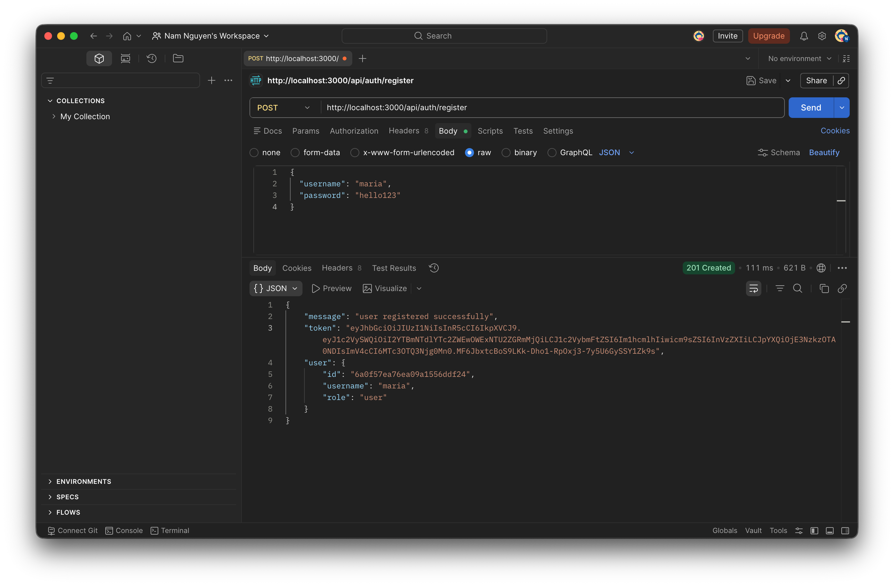
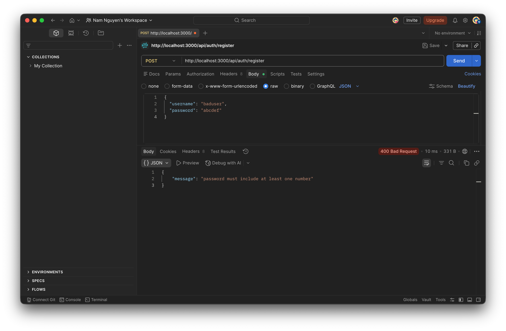

**Getting Transactions:**

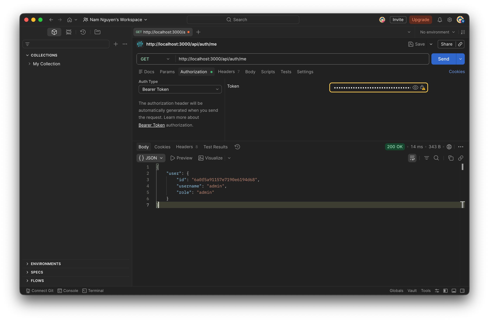

**Creating a Transaction:**
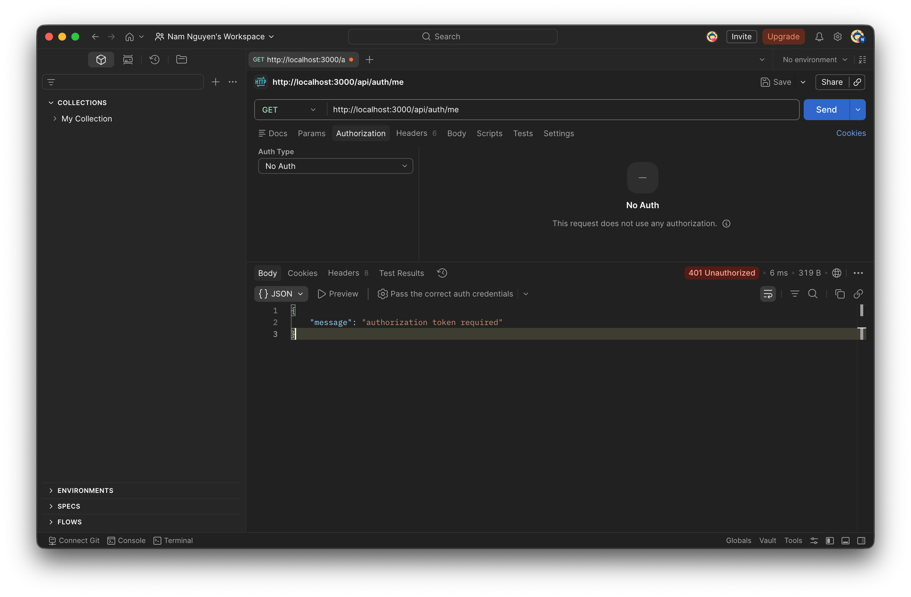
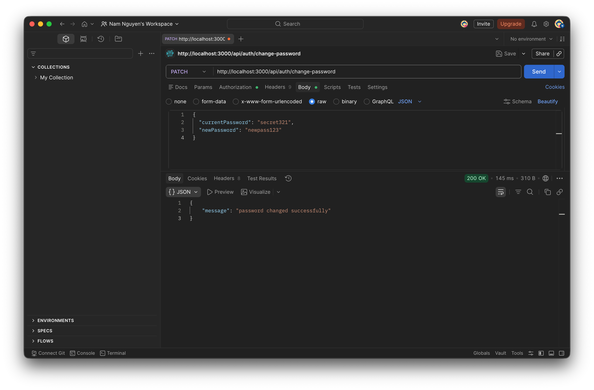

**Filtering by Date / Card:**
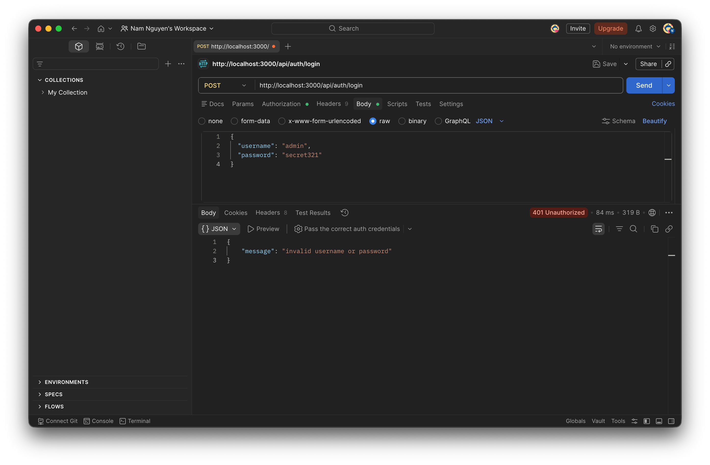

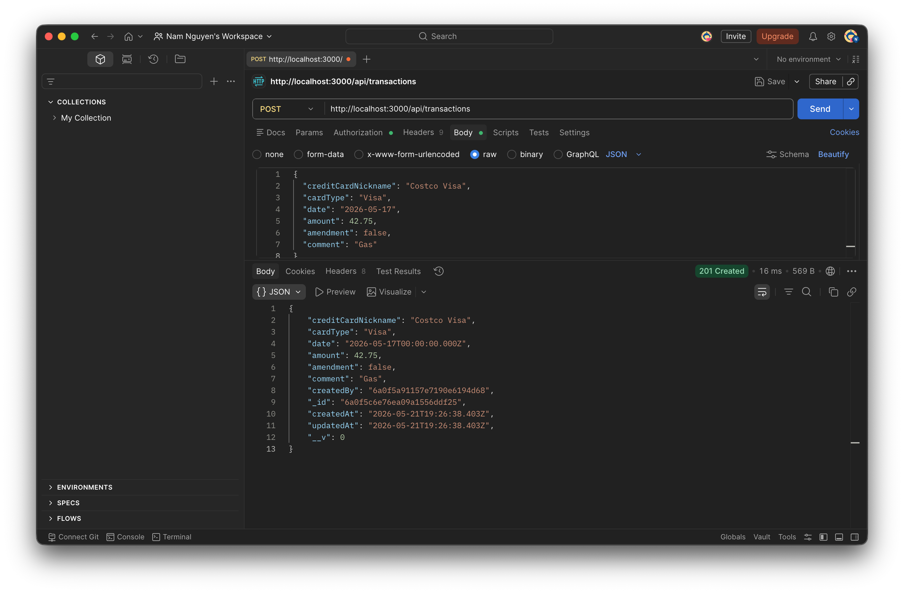
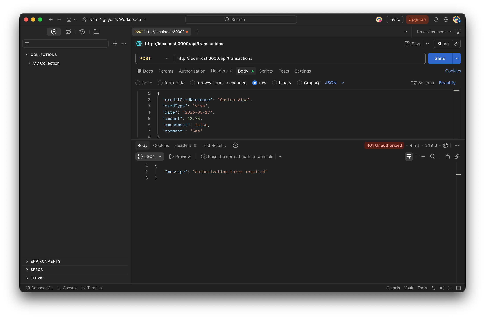
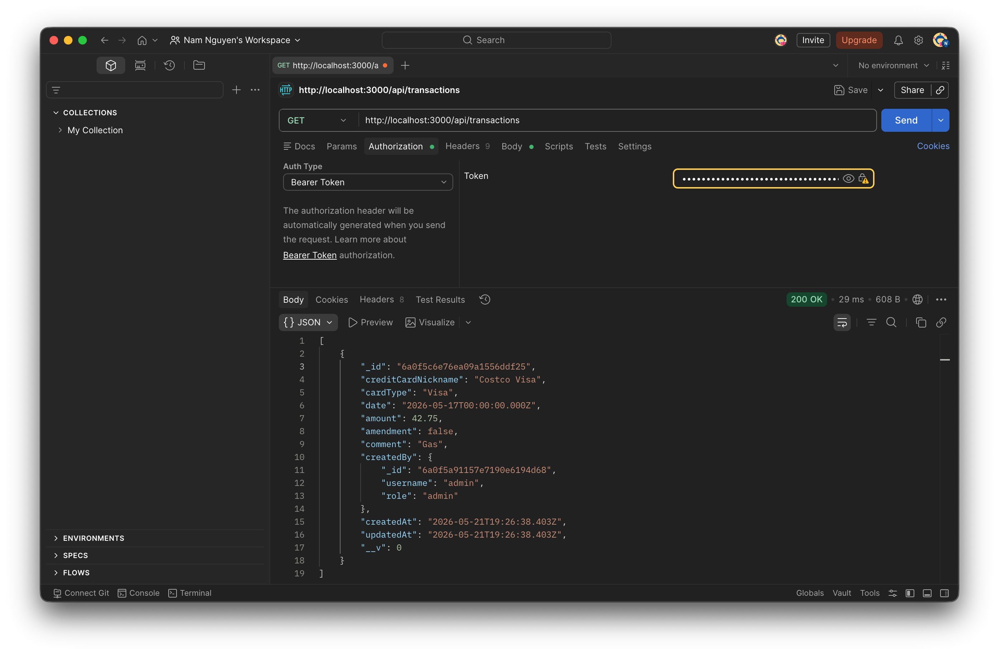

**Get One by ID:**
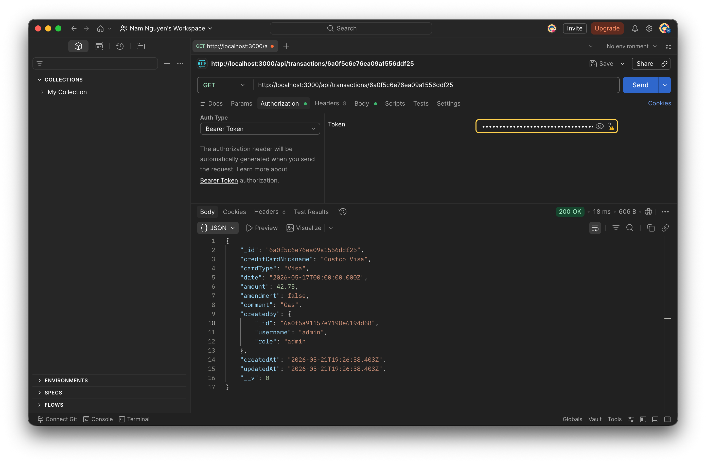
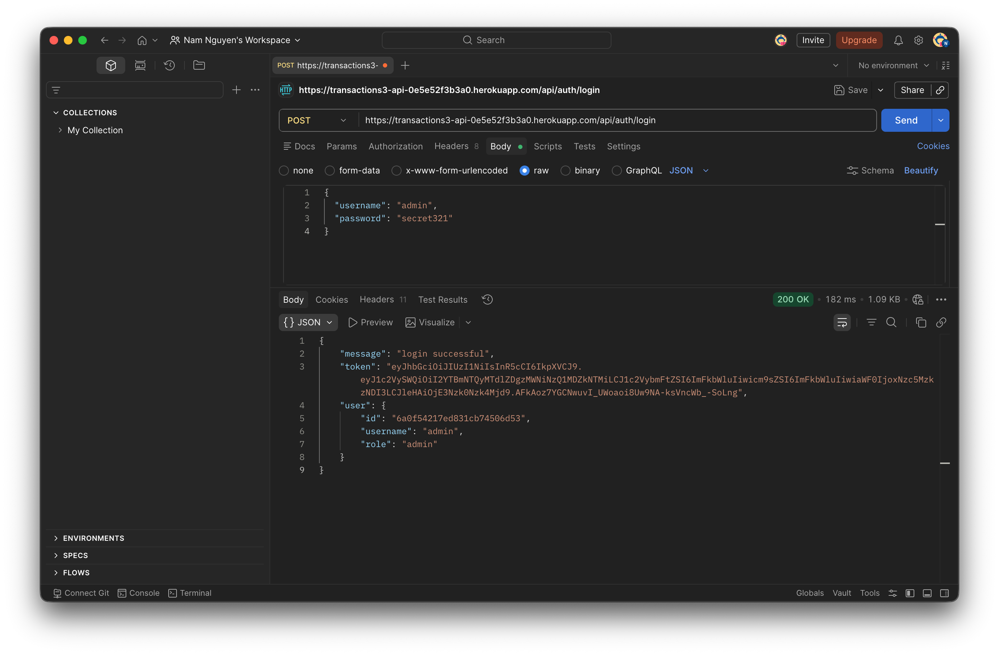
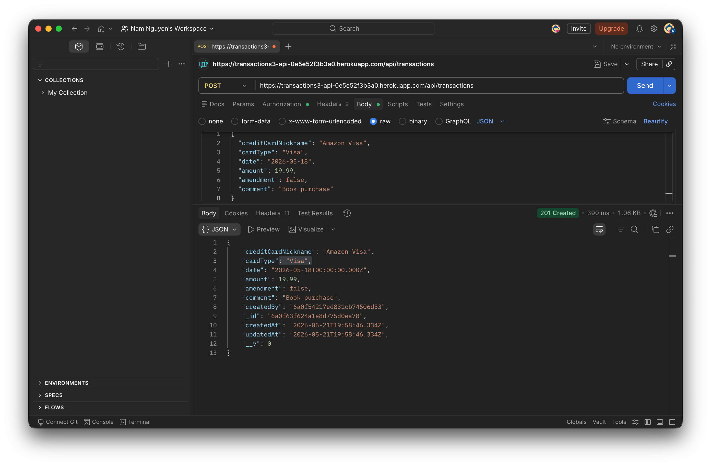
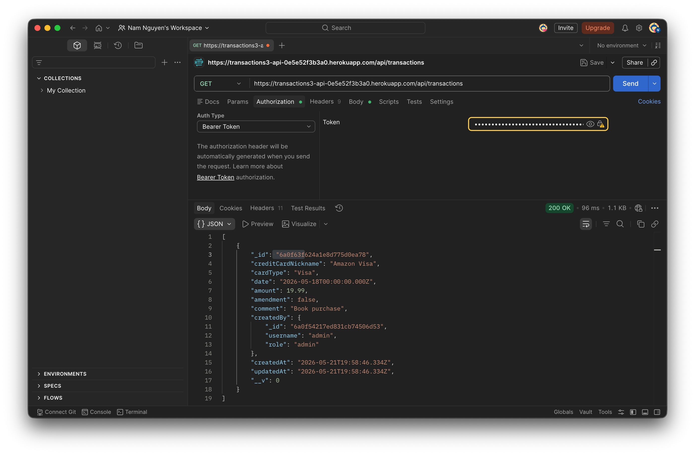

### 3. Running my App (Browser)

**Browser Tests:**
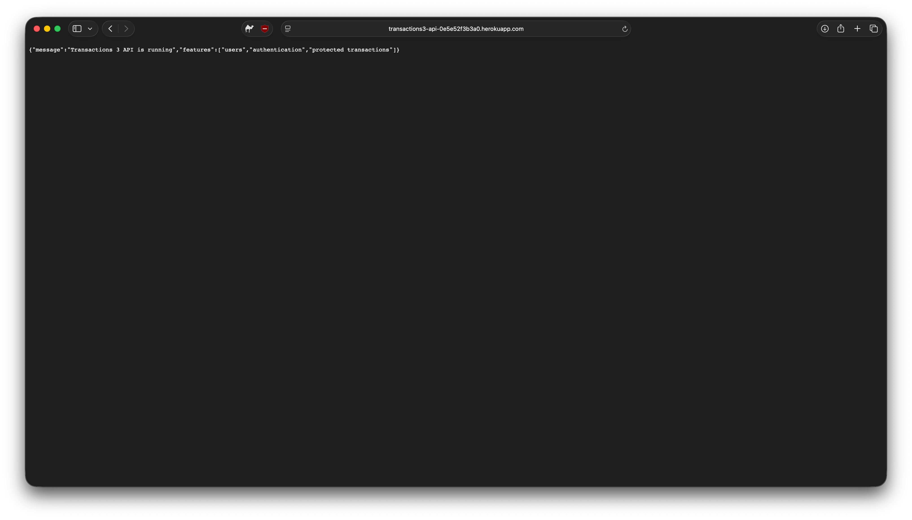
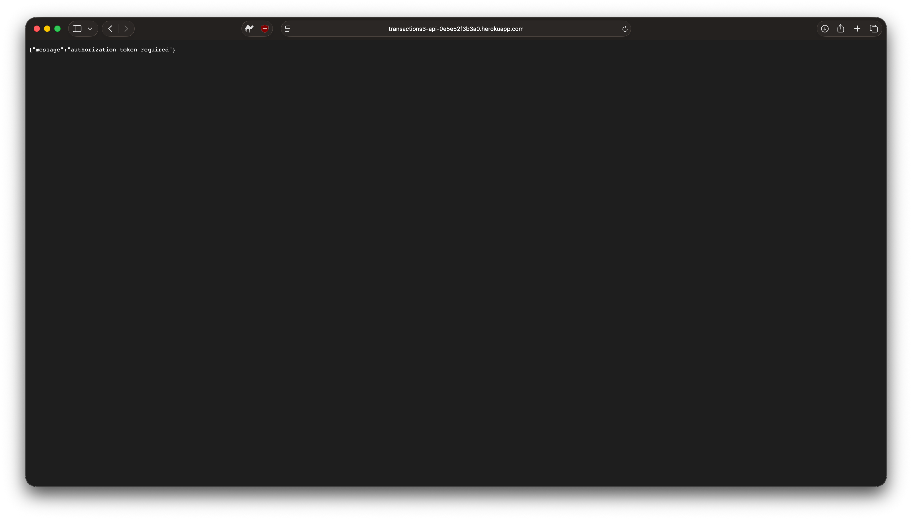

*Challenges with Browser Testing:* I got the public GET routes to show the raw JSON text in my browser just fine. But I couldn't really test the protected routes or the login there. Browsers default to GET requests when you type in a URL, and since we don't have a frontend UI, there's no way to easily attach the JWT Bearer token to the headers. So typing the protected route into Safari just gave me my "unauthorized" error screen (which at least proves the security works). I had to use Postman to actually test the auth stuff.

### 4. Differences
The biggest difference between 02 and 03 is all the security and auth stuff. App 02 was completely open, but 03 has actual login and registration routes. We added bcrypt to hash the passwords and jsonwebtoken (JWT) to keep users logged in. Also, 03 connects a User model to the Transaction model, whereas 02 just dumped all the transactions into one global pool.

### 5. Models
I definitely prefer the 03 models. The 02 way of having a single pool of transactions wouldn't really work for a real app. 03 separates users and transactions and ties them together, which makes way more sense since people need their own private data and accounts.

### 6. Challenges
I got super stuck on a Docker networking error for a while. I kept getting `MONGODB_URI is missing` and then a `getaddrinfo ENOTFOUND db` error when I tried to run my seed script. I eventually figured out it was because the database name in my `docker-compose.yml` didn't perfectly match the connection string in my `.env` file. Also, I realized I had to run the seed command explicitly inside the local Docker container shell instead of my regular Mac terminal so it could actually reach the database.

### 7. Questions
If we wanted to let users log in with Google or GitHub instead of making a new password from scratch, is that process similar to what we just built, or is it completely different?
